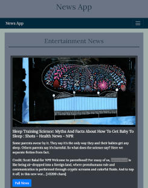

This project was bootstrapped with [Create React App](https://github.com/facebook/create-react-app).

# The Movie App
> Hi everyone! This is my The News App. 

## Live
https://mateuszlubianka1993.github.io/news-app/
https://news-app-x.herokuapp.com/

## Technologies:
* React
* Java Script
* HTML5
* CSS 3
* React-Bootstrap
* Redux
* Axios library
* Redux-thunk
* React-router-dom

## General info
This is my The News App. I've created it to develope my React and Redux skills. 
In this project I used react-router-dom so you can navigate between components. 
In this app you can see news, that i get from news API.  
https://newsapi.org/

## Screenshots

## Contact
Created by [lubiankamateusz@gmail.com] - feel free to contact me!